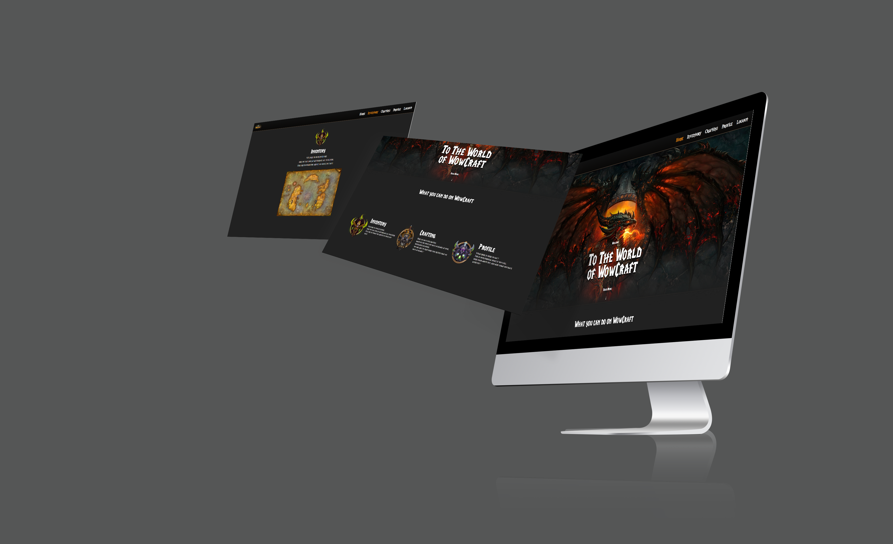
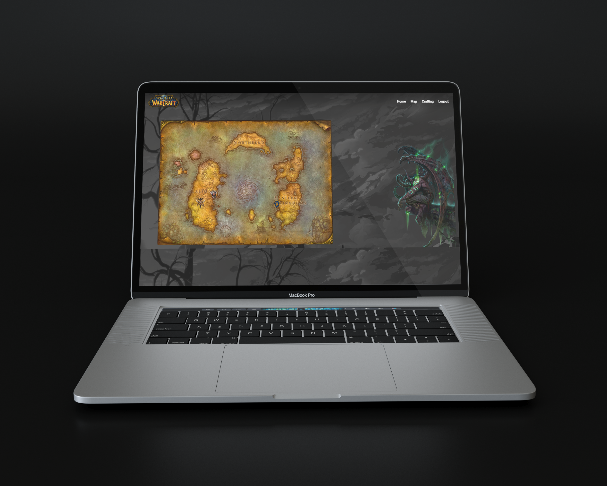

<br />


<h5 align="center" style="padding:0;margin:0;">Justin Koster</h5>
<h5 align="center" style="padding:0;margin:0;">200100</h5>
<h6 align="center">DV300 | Term 1</h6>
</br>
<p align="center">

  <a href="https://github.com/Justin-OwiStudent/WowCraft/blob/main/src/assets/LOGO.png">
    
  </a>
  
  <h3 align="center">Wow Craft</h3>

  <p align="center">
    A inventory management system project built for World of Warcraft with the MEAN Stack.<br>
    
   <br />
   <br />
   <a href="https://drive.google.com/file/d/1j6DtiOVNjZtj-PM3QdH7revrMJuhhsdm/view?usp=sharing">View Demo</a>
    ·
    <a href="https://github.com/Justin-OwiStudent/WowCraft/issues">Report Bug</a>
    ·
    <a href="https://github.com/Justin-OwiStudent/WowCraft/issues">Request Feature</a>
</p>


## Table of Contents

- [About the Project](#about-the-project)
  - [Project Description](#project-description)
  - [Built With](#built-with)
- [Getting Started](#getting-started)
  - [Prerequisites](#prerequisites)
  - [How to install](#how-to-install)
- [Features and Functionality](#features-and-functionality)
- [Concept Process](#concept-process)
  - [Ideation](#ideation)
  - [Wireframes](#wireframes)
- [Development Process](#development-process)
  - [Implementation Process](#implementation-process)
    - [Highlights](#highlights)
    - [Challenges](#challenges)
  - [Future Implementation](#peer-reviews)
- [Final Outcome](#final-outcome)
  - [Mockups](#mockups)
  - [Video Demonstration](#video-demonstration)
- [Conclusion](#conclusion)
- [License](#license)
- [Contact](#contact)
- [Acknowledgements](#acknowledgements)


## About the Project


<p align="center">

</p>

### Project Description

Welcome to WowCraft! This is a Inventory Management application that i built using Angular for the frontend and MongoDB for the backend.

### Built With
[&nbsp;&nbsp;&nbsp;&nbsp;&nbsp;&nbsp;&nbsp;&nbsp;](https://www.mongodb.com/cloud/atlas/lp/try4?utm_source=google&utm_campaign=gs_emea_south_africa_search_core_brand_atlas_desktop&utm_term=mongodb&utm_medium=cpc_paid_search&utm_ad=e&utm_ad_campaign_id=12212624560&adgroup=115749711783)
[&nbsp;&nbsp;&nbsp;&nbsp;&nbsp;&nbsp;&nbsp;&nbsp;](https://expressjs.com/)
[&nbsp;&nbsp;&nbsp;&nbsp;&nbsp;&nbsp;&nbsp;&nbsp;](https://angular.io/)
[&nbsp;&nbsp;&nbsp;&nbsp;&nbsp;&nbsp;&nbsp;&nbsp;](https://nodejs.org/en/)


## Getting Started

The following instructions will get you a copy of the project up and running on your local machine for development and testing purposes.

### Installation

Here are a couple of ways to clone this repo:

1.  GitHub Desktop </br>
    Enter `https://github.com/Justin-OwiStudent/WowCraft.git` into the URL field and press the `Clone` button.

2.  Clone Repository </br>
    Run the following in the command-line to clone the project:

    ```sh
    git clone https://github.com/Justin-OwiStudent/WowCraft.git
    ```

        Open `Software` and select `File | Open...` from the menu. Select cloned directory and press `Open` button

3.  Install Dependencies </br>
    Run the following in the command-line to install all the required dependencies:

    ```sh
    npm install
    ```
3.  Run Application </br>
    Run the following in the command-line to run the application:

    ```sh
    ng serve
    ```

## Features and Functionality


### Login & Signup

<p align="center">

</p>
The user that accesses the application can register or login for the application.

### Locations and Items

<p align="center">

</p>
The user has the options to access three different locations with their own items, the user can update each item based on that location.

### Craft a Recipe

<p align="center">

</p>
The User can craft a recipe based on location and availability of ingredients in that location.

## Concept Process

With the theme being world of warcraft i decided to make everything kind of dark with bright accent colours, just like in the game, spells and abilities always have bring colours.

### Mood Board


<p align="center">

</p>

### Wireframes


<p align="center">

</p>

## Development Process

The `Development Process` is the technical implementations and functionality done in the frontend and backend of the application.

### Implementation Process

- I used `ng new Wowcraft` to create this Angular project. I implemented component-based development instead of classes. By doing this, I will be able to easily inject and eject components and sub-components into my project, making it refactorable and reusable instead of writing up classes I have to do everytime making it tedious and redundant

- I implemented the `typegoose` dependency to communicate with the backend which i used MongoDB for.


#### Highlights


- A highlight for me was using the MEAN stack, i found the MEAN stack is very great to work with

#### Challenges


- I got confused with all the different files i had to work with, all the services adn then their components and those components inside of other components.
- I had a major error with my backend crashing when calling my one Locations crafting recipes, turns out i had the ID of an item wrong.
- I struggled with PIPES.


### Future Implementation


- I would like to add a user profile page that displays the amount of recipes the user has crafted. 
- I want to showcase on the user profile all the crafted Recipes.
- Add JWT, more validation and route protection
- I want the user to be able to create new recipes and items that they can add by themselves.


## Final Outcome

### Mockups


<br>

<!-- VIDEO DEMONSTRATION -->

### Video Demonstration

<!-- TODO Change this -->

To see a run through of the application, click below:

[View Demonstration](https://drive.google.com/file/d/1j6DtiOVNjZtj-PM3QdH7revrMJuhhsdm/view?usp=sharing)

See the [open issues](https://github.com/Justin-OwiStudent/WowCraft/issues) for a list of proposed features (and known issues).

<!-- AUTHORS -->

## Authors

- **Justin Koster** - [Github](https://github.com/Justin-OwiStudent)

<!-- LICENSE -->

## License

Distributed under the MIT License. See `LICENSE` for more information.\

<!-- LICENSE -->

## Contact

- **Justin Koster** - [200100@virtualwindow.co.za](200100@virtualwindow.co.za) 
- **Project Link** - https://github.com/Justin-OwiStudent/WowCraft

<!-- ACKNOWLEDGEMENTS -->

## Acknowledgements

<!-- all resources that you used and Acknowledgements here -->
<!-- TODO Change this -->

- [Stack Overflow](https://stackoverflow.com/)
- [Figma](https://www.figma.com/)
- [Wowiki](https://wowwiki-archive.fandom.com/wiki/WoWWiki:WoW_Icons/Icon_List/Images#Potions)
- [pngegg](https://www.pngegg.com/)

Footer
© 2023 GitHub, Inc.
Footer navigation
Terms
Privacy
Security
Status
Docs
Contact GitHub
Pricing
API
Training
Blog
About
rust-stash/README.md at main · Justin-OwiStudent/WowCraft